## **Who I am**

I am UnbuiltAlmond8, a male software developer who is interested in astronomy, technology, AI and programming in general (including some other categories, but these are the majority of my life). My age is not to be shared with anyone, but I have been working on many kinds of projects including the ones seen here, such as DosndysWorld, PHPKoboDeobfuscator, and LingojamTranslatorAPI, but sometimes I stop working on some of them for a long while due to several life-related changes. I've been studying the Milky Way, Python, JavaScript, anti-bot systems (such as BotGuard and Cloudflare Turnstile, but do not expect publication of research results), and other topics.

## **My projects**

- LingojamTranslatorAPI - A slightly modified version of Lingojam's client side code for usage in Node.js and servers. The integrity checks were very lightly obfuscated and easily discovered, stripped in this project.
- JSDefenderDeobfuscator - A deobfuscator for JSDefender.
- GoogleKeepWrapped - A fan made website for a Wrapped for Google Keep, as Google does not provide an official version.
- PHPKoboDeobfuscator - A deobfuscator for PHPKobo, building upon the work of the creator of deobfuscate.io to crack the entire suite in milliseconds.
- DosndysWorld - A terminal-based game based off of Dandy's World. Simplistic, but configurable. Not affiliated with Qwel.
- ProtonOS - A Scratch OS with various features and has its own terms of service that is integrated across my entire project ecosystem, extending to Eima Jolum and my friend Logy. Includes proprietary AlmondGuard anti-bot system.
- JolumOS - The operating system for Eima Jolum, based on ProtonOS.
- Story of Eima Jolum - A 72 page long book about Eima Jolum. Available for free and open source on Scribd and as a direct download on Eima Jolum's website (see [@EimaJolum](https://github.com/EimaJolum) for details).
- UnbuiltAlmond8's API - My own API, hosted on Cloudflare Workers. See the Google Sites for the URL and other projects.

## **Contributions**

- Welcomer - fixed a wording issue in the Leaver section of the dashboard.
- ofunctions - added a previously omitted import in the code snippet under the JSON sanitizer section.

## **Where you can find me**

You can find me on the majority of known websites including: Websim.ai, Wildwest.gg, Ideogram.ai, Character.AI, YouTube, Instagram, KlingAI, Steam, Roblox, Twitch, GitHub, Scratch, Newgrounds, HuggingFace, Odysee, JigsawPlanet, Reddit, Wayback Machine, DeviantArt, RoomStyler, Discord, Wikipedia, X (formerly Twitter), Bluesky, NameMC, GitLab, CapCut, Snapchat, Bitly, Eventbrite, Grabify, Socialblade, TikTok, and Minecraft.

The usernames on these websites is UnbuiltAlmond8. This is NOT an exhaustive list. If in doubt, please ask me on any of the platforms listed here. I do NOT have any account on any NSFW website, please report any impersonators there. <!-- Note however that some of these platforms may use the old username DastardlyCop268, but that's an indicator that I don't use that site anymore if no UnbuiltAlmond8 account exists there. -->

## **Statistics**

